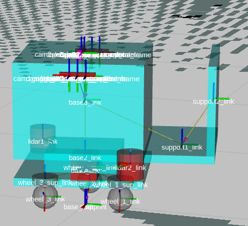

# CALL-M_core
https://github.com/Noceo200/CALL-M_core.git

This workspace contain all the necessary files and ROS2 packages to install, build and operate the omnidirectionnal robot CALLM. This robot is developed to be automnomous or teleoperated with collision safe assisstance.
|||
|:--:|:--:|

# Requirements
* CUDA compatibles Graphic card (NVIDIA)
* Laptop with amd64 architecture
* Ubuntu 22.04

# QUICK START
For this quickstart, we assume you already have a CALLM robot with set up computers on which the workspace is installed, or that you only want to use the simulated environnement. If you need to set a robot, check the section ["SET UP CALLM ROBOT"](#set-up-callm-robot) on this README.

* Clone this workspace with all its submodules (execute where yu want to place the workspace)
```
git clone --recurse-submodules -j8 https://github.com/Noceo200/CALL-M_core.git
```
* Install the workspace on your computer (will automaticcaly install all needed dependancies)
```
bash CALL-M_core/set_up_robot/1_Set_up_USER_dev_amd64.sh
```
* Follow the instructions printed after the workspace installation.
* Restart your computer
* Build the workspace
```
cd CALL-M_core/robot_ws_ros2/
bash clean_build.sh
```
* Source the workspace in /home/user/.bashrc, add the following line:
```
source /<your_path>/CALL-M_core/robot_ws_ros2/src/call_m_monitor
```
* Restart your terminal, workspace is installed.
### Example of running simulation
```
ros2 launch call_m_start_all call_m_simulation.launch.py mode:=COMPLETE nav_type:=none
```
The simulation and all controllers should start, the robot should be building a map when you move it around. For that, you can connect a joystick or select the Xterm windows with the keyboard instructions, and operate from here.
* Details for parameters are given in the section ["PARAMETERS"](#parameters)
### Example of operating the real robot
* execute on the NUC:
```
ros2 launch call_m_start_all call_m_hardware.launch.py version:=NUC mode:=DRIVERS
```
* execute on the JETSON:
```
ros2 launch call_m_start_all call_m_hardware.launch.py version:=JETSON
```
* execute on the terminal (your Laptop):
```
ros2 launch call_m_start_all call_m_hardware.launch.py version:=CLIENT mode:=DRIVERS nav_type:=none
```
* For the real robot to move, the TriOrb needs to be activated, so you can follow the Joystick instructions or do it manually by executing those commands, one by one in the same order:
```
ros2 lifecycle set /triorb configure
ros2 lifecycle set /triorb activate
```
* Details for parameters are given in the section ["PARAMETERS"](#parameters)
* Computers IPs and identifiers can be found in ["HARDWARE INFORMATIONS"](#hardware-informations)

# PARAMETERS
## Simulation
|Name|Type|Details|
| :-- | :--: | :-- |
|mode|COMPLETE or API|Define on which mode to use.<br>-'COMPLETE': Launch the simulation, the controllers (joystick and keyboard) and the default navigation system which contains the low level collision avoidance, the navigate to point using vector field, and the assissted teleoperation using vector field features. As the navigation is managed, the user may directly use the robot by sending position and speeds commands with the joystick or the keyboard<br>-'API': This mode launch everything but the controllers, so the control can be managed by an external custom ROS2 package |
|nav_type|none, on_fly or localize|Define which type of navigation should be launch. <br>- 'none' means that only the SLAM will be launched, no automnomous navigation is launched, meaning that the user migh use a custom one if needed. <br>- 'on_fly' means that all the navigation features will be available (assissted teleoperation and navigate to pose) and the robot will map or discover the environnement during run time.<br>- 'localize' means that all the navigation features will be available (assissted teleoperation and navigate to pose) but the robot will use a know given map to navigate. It will still adapt to new dynamic obstacles, but not map them. Usually this mode is lighter than 'on_fly' so it should be used when the map is known. |
|nav_mode|.yaml file path|NAV2 allow to configure several parameters to have the wanted behavior. In CALLM case we only use NAV2 for path planning, so this file allow to customise it. [NAV2 Documentation](#https://docs.nav2.org/)|
|map_loc|.yaml file path|Map to consider when doing navigation in localized mode (nav_type:=localize)|
|slam_param|.yaml file path|Configuration file for SLAM|

## Real robot

### NUC Launch parameters
|Name|Type|Details|
| :-- | :--: | :-- |
|version|NUC, JETSON, CLIENT or FULL|Define on which computer the nodes is launched, for example, the NUC will launch some Nodes and the JETSON version will launch some other nodes like the zed_wrapper. The package can not be used on the NUC as it doesn't have a CUDA compatible graphic card.|
|mode|DRIVERS or API|Define on which mode to use.<br>-'DRIVERS': start just the necessary nodes to control the Actuators and publish sensors data. The user may plug any ROS2 external controller, navigation system on the robot.<br>-'API': This mode do like the DRIVERS mode but also launch the default navigation system which contains the low level collision avoidance, the navigate to point using vector field, and the assissted teleoperation using vector field features. As the navigation is managed by the NUC, the user may directly use the robot by sending position and speeds commands.|
|nav_type|none, on_fly or localize|Define which type of navigation should be launch. <br>- 'none' means that only the SLAM will be launched, no automnomous navigation is launched, meaning that the user migh use a custom one if needed. <br>- 'on_fly' means that all the navigation features will be available (assissted teleoperation and navigate to pose) and the robot will map or discover the environnement during run time.<br>- 'localize' means that all the navigation features will be available (assissted teleoperation and navigate to pose) but the robot will use a know given map to navigate. It will still adapt to new dynamic obstacles, but not map them. Usually this mode is lighter than 'on_fly' so it should be used when the map is known. |
|nav_mode|.yaml file path|NAV2 allow to configure several parameters to have the wanted behavior. In CALLM case we only use NAV2 for path planning, so this file allow to customise it. [NAV2 Documentation](#https://docs.nav2.org/)|
|map_loc|.yaml file path|Map to consider when doing navigation in localized mode (nav_type:=localize)|
|slam_param|.yaml file path|Configuration file for SLAM|

### JETSON Launch parameters
None, the JETSON doesn't run any feature that can be configured from the terminal yet.

### TERMINAL Launch parameters
Similar to [NUC parameters](#nuc-Launch-parameters).

### COMPATIBILITY
The only parameter to 

# HARDWARE INFORMATIONS
<div style="text-align: center;">
  
</div>

## 

## callm01 IPs
* callm01c (NUC): 150.18.226.30
* callm01v (JETSON): 150.18.226.22
* BUFFALO router: 150.18.66.94

# SOFTWARE INFORMATIONS

## Workspace informations
* Hardware_doc:
	Contains informations and links to help set up the components.
		
* resources:
	Contains divers resources like images, schematics.

* robot_ws_ros2:
	This is the main directory that contains the whole ros2 workspace for using the simulated or the real CALL_M robot. (Check the README file in this directory for more details)
	
* tools_programs:
	Contains other useful programs for debugging or set up the components correctly. (Check the README file in this directory for more details)

## Configurations and customizations

To change the configurations and customize the navigation, check the README file 'robot_ws_ros2/README.md'.

## Set up callm robot
To reset, set up, or reinstall the workspace on one of the computers, check the [README file](set_up_robot/README_instructions.md) in the set_up_robot directory.

# DEVELOPER NOTES

This section is used as a TO DO list of features that still need to be implemented or modified. There is no specific order, the developer may decide what is urgent or not.
| Label | Detail | Location of interest | Status |
| :-- | :--: | :--: | --: |
| Update CALLM model in simulation | The current model dosen't contains UR5 arm and ultrasonic sensors | robot_ws_ros2/ src/ call_m_supervisor/description/ bot/ | To do |
| Change control axis | Currently sending a positive speed on X axis correspond to a Y axis motion, other controls are also not mapped correctly, the correction to do is just a rotation transformation on the speed vector in the drivers of the TriOrb, but this transformation should also be inversly applied to the Odometry sent by the Triorb | robot_ws_ros2/ src/ call_m_hardware/ call_m_triorb_ros2/ call_m_triorb_ros2/ triorb_v2.py | To do |
| Allow namespace configuration at launch | Currently everything is running without a namespace, so it is impossible to launch several simulations or real robots on the same network. One of the branch on the github ('namespace_control_update_tentative') is already trying to solve that | Launch files parameters | Paused |
| Allow to set up configs file at launch | It would be convenient to allow any user to specify different configurations files to use instead of the defaults ones. The files paths would be given directly in the launch command as it is currently with the parameter 'nav_mode' for example | Launch files parameters | To do |

# CHANGES LOG

## 2024/08/01 
### Update NUC packages for API mode
As it wasn't managing that before, The NUC didn't have the requiered packages to run the navigation features. The file robot_ws_ros2/2_export_set_up_files.sh had been updated so that the necessary packages are now sent to the NUC automatically along with the other ones.

### Update USER Laptop Set up file
The file 'set_up_robot/1_Set_up_USER_dev_amd64.sh' now contain commands to automatically install and configure chrony on the user computer. That wasn't the case before, but chrony is necessary to obtain a good synchronisation with the robot computers.

